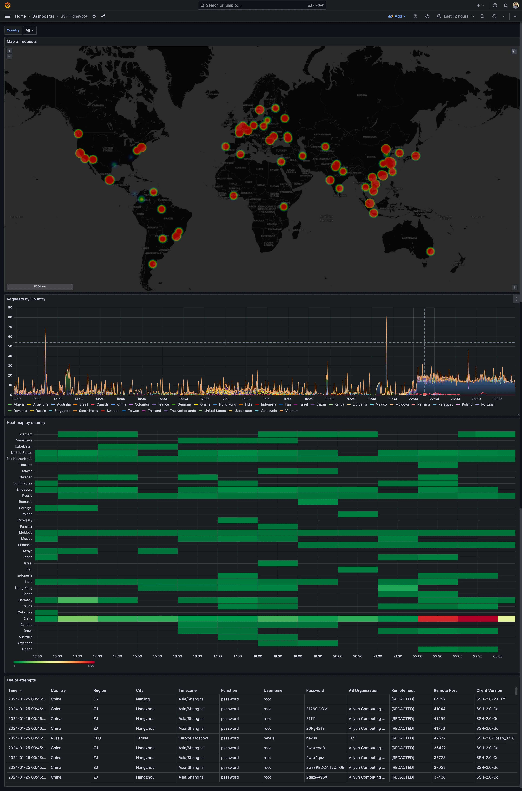

In the dynamic world of cybersecurity, proactively defending against potential threats requires a combination of innovative techniques and intelligent design. In this post, we’ll explore the creation of an SSH server honeypot in Golang, leveraging [goroutines](https://go.dev/tour/concurrency/1) for non-blocking processing, implementing a global cache to manage rate limits from ip-api.com, and incorporating exponential backoff for graceful error handling. The goal is to build a responsive and resilient defense system capable of efficiently handling multiple attack attempts while gathering valuable insights into potential threats.


## Setting Up the SSH Honeypot with Goroutines

To create a highly responsive SSH server honeypot, we’ve embraced the power of goroutines in Golang. By employing concurrent programming, our honeypot can handle multiple attack attempts simultaneously without blocking the processing of subsequent requests. This optimisation not only enhances the honeypot’s scalability but also ensures that potential attackers are not deterred by slow response times. Performing all the heavy processing (e.g. fetching more information about the attacker and writing the information to the database) allows us to gather more data and insights.

```go {linenos=true,anchorlinenos=true}
func main() {

	// ...

	ssh.Handle(func(s ssh.Session) {

		go processRequestExponentialBackoff(writeAPI, s.Context(), ctx, tracer)

		i := 0
		for {
			i += 1
			log.Printf("Session active seconds: %d", i)
			select {
			case <-time.After(time.Second):
				continue
			case <-s.Context().Done():
				log.Printf("Closed connection from '%s' to '%s@%s'", s.RemoteAddr().String(), s.User(), s.LocalAddr().String())
				return
			}
		}
	})

	// ...

	log.Printf("Starting ssh server on port '%s'...", sshPort)
	server := &ssh.Server{
		Addr:        ":" + sshPort,
		MaxTimeout:  DeadlineTimeout,
		IdleTimeout: IdleTimeout,
		Version:     "OpenSSH_7.4p1 Debian-10+deb9u7",
		PublicKeyHandler: func(s ssh.Context, key ssh.PublicKey) bool {
			go processRequestExponentialBackoff(writeAPI, s, ctx, tracer)

			return false
		},
		PasswordHandler: func(s ssh.Context, password string) bool {
			go processRequestExponentialBackoff(writeAPI, s, ctx, tracer)

			return false
		},
	}

	server.AddHostKey(hostKey)
	log.Fatal(server.ListenAndServe())
}

```


## Global Cache for Intelligent Rate Limiting

The integration of [ip-api.com](http://ip-api.com/) for IP information retrieval brings with it rate limits on API requests. To efficiently manage these limits and prevent service disruptions, we’ve implemented a global cache. This cache intelligently tracks recent requests, enabling the honeypot to stay within the specified limits and implement retries with exponential backoff . The result is a continuous flow of valuable IP information while strategically handling rate limits to avoid potential disruptions in service.


```go {linenos=true,anchorlinenos=true}
var (
	c = cache.New(5*time.Minute, 10*time.Minute)
)

func getIpApi(host string, ctx context.Context, tracer trace.Tracer) (IpApi, error) {

	wait, found := c.Get("getIpApiRt")
	if found && wait.(time.Duration) > 0*time.Second {
		log.Printf("Rate limit key found on cache, sleeping for %s", wait)
		time.Sleep(wait.(time.Duration))
	}

	// ...

	url := fmt.Sprintf("http://ip-api.com/json/%s?fields=%s", host, strings.Join(fields, ","))
	req, err := http.NewRequest("GET", url, nil)
	if err != nil {
		if found {
			log.Printf("Error creating request for ip-api.com, re-invoking request after sleeping for %s", wait)
			c.Set("getIpApiRt", wait.(time.Duration)+1*time.Second, wait.(time.Duration)+1*time.Second)
		} else {
			log.Printf("Error creating request for ip-api.com, re-invoking request after sleeping for 1 second")
			c.Set("getIpApiRt", 1*time.Second, 1*time.Second)
		}

		return IpApi{}, err
	}
}
```


## Exponential Backoff and Error Handling

Errors, an inevitable part of internet interactions, require a nuanced approach. Exponential backoff is an intelligent retry mechanism designed to gracefully handle errors during processing. By exponentially increasing the time between retry attempts, our honeypot mitigates disruptions caused by rate limits and other transient issues, aligning with emphasis on fault tolerance.

```go {linenos=true,anchorlinenos=true}
func processRequestExponentialBackoff(writeAPI InfluxdbWriteAPI, sshContext ssh.Context, ctx context.Context, tracer trace.Tracer) error {
	backoffSettings := backoff.NewExponentialBackOff()
	backoffSettings.MaxElapsedTime = 30 * time.Minute
	backoffContext := backoff.WithContext(backoffSettings, childCtx)

	operation := func() error {
		return processRequest(writeAPI, sshContext, backoffContext.Context(), tracer)
	}

	err := backoff.Retry(operation, backoffContext)
	if err != nil {
		log.Printf("Failed to process request: %v", err)
		return err
	}

	log.Printf("Successfully processed request")
	return nil
}
```


## Visualising Attack Patterns with Grafana

Our honeypot’s data finds its home in InfluxDB, and Grafana becomes the canvas for visualisation. A custom Grafana dashboard allows us to monitor attacker locations in real-time, providing a comprehensive view of potential threats. This integration is a commitment to powerful visualisation tools enhancing situational awareness and aiding swift responses to emerging security challenges.

```go {linenos=true,anchorlinenos=true}
func writeToInfluxDB(writeAPI InfluxdbWriteAPI, ipInfo IPInfo, sshInfo SSHInfo, ctx context.Context, tracer trace.Tracer) error {

	point := influxdb2.NewPointWithMeasurement("request").
		AddField("latitude", ipInfo.Latitude).
		AddField("longitude", ipInfo.Longitude).
		AddTag("ip", ipInfo.IP).
		AddTag("country", ipInfo.Country).
		AddTag("city", ipInfo.City).
		AddTag("region", ipInfo.Region).
		AddTag("org", ipInfo.Org).
		AddTag("timezone", ipInfo.Timezone).
		AddTag("user", sshInfo.User).
		AddTag("remote_host", sshInfo.RemoteHost).
		AddTag("remote_port", sshInfo.RemotePort).
		AddTag("local_host", sshInfo.LocalHost).
		AddTag("local_port", sshInfo.LocalPort).
		AddTag("client_version", sshInfo.ClientVersion).
		AddTag("function", sshInfo.Function).
		AddTag("password", sshInfo.Password).
		AddTag("key", sshInfo.Key).
		SetTime(sshInfo.Timestamp)

	if os.Getenv("INFLUXDB_NON_BLOCKING_WRITES") == "true" {
		log.Printf("Writing to InfluxDB in non-blocking mode")
		errorsCh := writeAPI.WriteAPI.Errors()
		go func() error {
			for err := range errorsCh {
				log.Printf("write error: %s\n", err.Error())
				return err
			}

			return nil
		}()
		writeAPI.WriteAPI.WritePoint(point)
	} else {
		log.Printf("Writing to InfluxDB in blocking mode")
		err := writeAPI.WriteAPIBlocking.WritePoint(context.Background(), point)
		if err != nil {
			log.Printf("failed to write to InfluxDB: %v", err)
			return err
		}
	}

	return nil
}
```




## Manual Otel Instrumentation

One of the motivations for this project was to better understand how to instrument a Golang application with Otel for comprehensive monitoring. Considering this requirement two major approaches were found. The first one is [automatic](https://github.com/open-telemetry/opentelemetry-go-instrumentation) — Go libraries are instrumented by [eBPF](https://ebpf.io/). The second one is to manually instrument all the methods. This was the chosen path, since the purpose of this project is to better understand all the Otel+Golang world. With that, this addition empowers us with in-depth insights into our honeypot’s performance, enabling the identification of vulnerabilities and optimisation for enhanced security.

```go {linenos=true,anchorlinenos=true}
func processRequest(writeAPI InfluxdbWriteAPI, sshContext ssh.Context, ctx context.Context, tracer trace.Tracer) error {
	childCtx, span := tracer.Start(
		ctx,
		"processRequest")
	defer span.End()

	span.AddEvent("Request inccoming")
	log.Printf("Request to '%s' from '%s'", sshInfo.Function, remote_host)
	ipInfo, err := getIpInfo(sshInfo.RemoteHost, childCtx, tracer)
	if err != nil {
		span.RecordError(err)
		span.SetStatus(codes.Error, err.Error())
		log.Printf("Failed to get IP info: %v", err)
		return err
	}

	if writeToInfluxDB(writeAPI, ipInfo, sshInfo, childCtx, tracer) != nil {
		span.RecordError(err)
		span.SetStatus(codes.Error, err.Error())
		log.Printf("Failed to write to InfluxDB: %v", err)
		return err
	}

	span.AddEvent("Request successfully processed")
	span.SetStatus(codes.Ok, fmt.Sprintf("Request to '%s' from '%s' successfully processed", sshInfo.Function, remote_host))
	return nil
}
```


As it can be seen on the previous image, around 10PM the error rate and the 95th percentile increased — this was due to an increase on requests to the server and the need to limit the rate of the requests to ip-api.com due to service imposed rate limits. In this case these errors are merely informative, but other errors are also captured; one example are the errors related to failed writes to InfluxDB — these ones can be filtered and alerts can be created in order to alert the maintainers of the application to take actions to mitigate the issue.


## A Symphony of Components

The orchestrated interplay of goroutines, global caching, exponential backoff, InfluxDB, Grafana, and Otel transforms our SSH honeypot into a resilient and responsive defense mechanism. This architecture not only improves the efficiency of handling attacks but also ensures adaptability in the face of potential disruptions.

In crafting a simple SSH server honeypot in Golang, our narrative echoes the principles of embracing concurrency, caching, and intelligent error handling. In the ever-shifting landscape of cybersecurity, staying agile and secure is not just a goal; it’s a way of life.

## Useful links

* https://github.com/marceloalmeida/ssh-honeypot


## References
* https://github.com/open-telemetry/opentelemetry-go-instrumentation
* https://github.com/open-telemetry/opentelemetry-go
