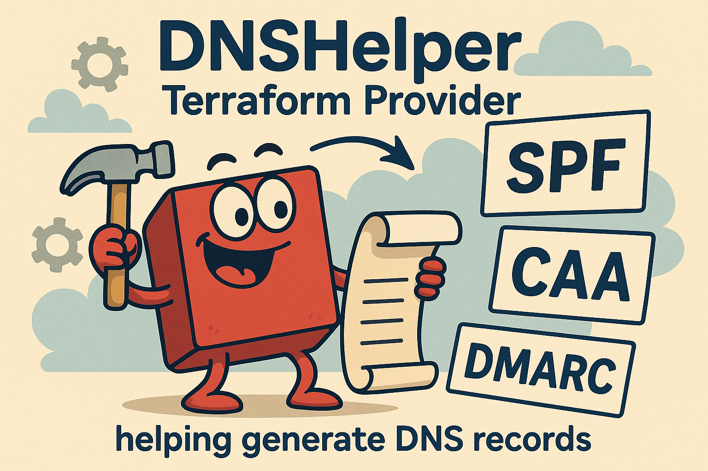
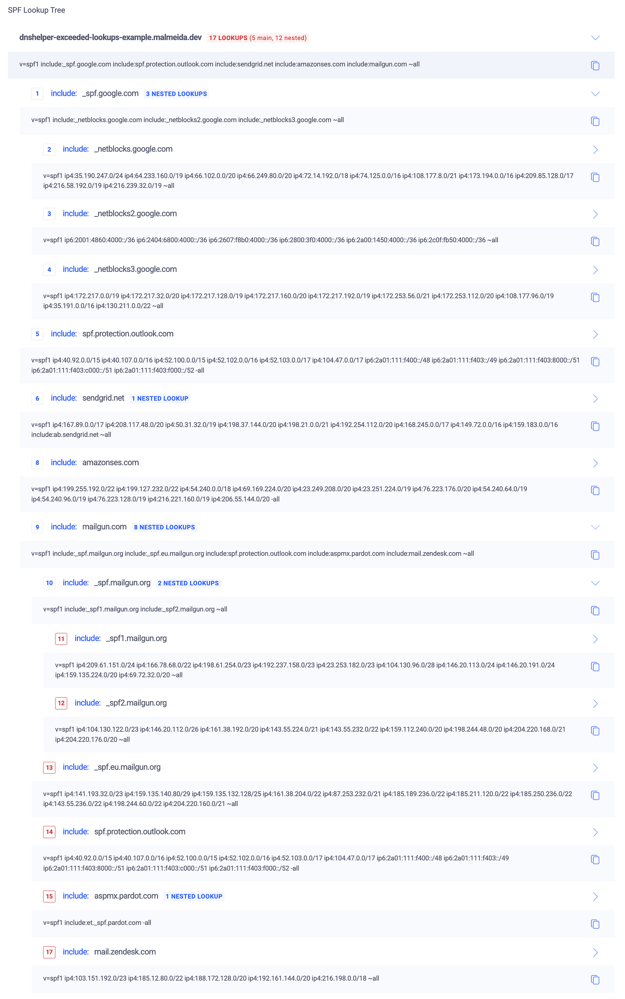
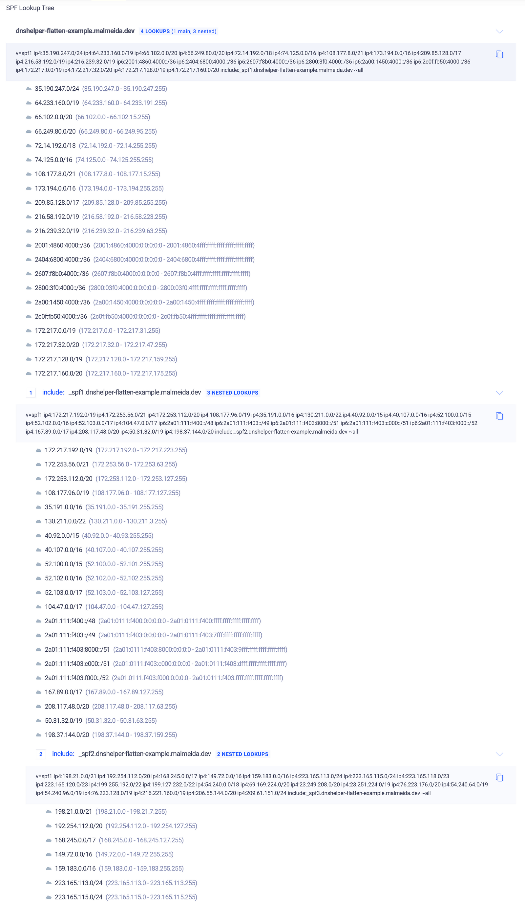

DNS is critical to modern infrastructure, yet managing records like **SPF**, **DMARC**, and **CAA** remains frustrating. These records are essential for security and email authentication, but they come with **strict constraints, tricky syntax, and room for errors**.

Inspired by **[DNSControl](https://github.com/StackExchange/dnscontrol)**, I built **[Terraform DNS Helper](https://github.com/marceloalmeida/terraform-provider-dnshelper)** - a Terraform provider that **enhances existing DNS providers (AWS Route 53, Cloudflare, etc.) by providing functions to generate complex DNS records automatically.**

🚀 **DNS Helper does NOT replace your existing Terraform DNS provider.** Instead, it works alongside it, simplifying record generation so you can manage DNS infrastructure **with less manual effort and fewer mistakes.**


# What Does Terraform DNS Helper Do?

Terraform DNS Helper introduces extra functions that help you generate complex DNS records dynamically. It works **alongside** existing DNS management providers (e.g., AWS Route 53, Cloudflare, Google Cloud DNS).

## With **DNS Helper**, you can:

✅ **Build SPF records dynamically**, flattening includes to stay within [RFC 7208](https://datatracker.ietf.org/doc/html/rfc7208)'s 10-lookup limit.

✅ **Split oversized TXT records automatically**, ensuring compliance with DNS size restrictions.

✅ **Generate DMARC records from human-readable inputs**, reducing syntax errors.

✅ **Create CAA records effortlessly**, controlling certificate issuance with a simple structure.


Rather than hardcoding long, error-prone DNS strings, **DNS Helper generates them for you**, making Terraform configurations **cleaner, more maintainable, and scalable**.

# SPF: Smarter Record Flattening

SPF (Sender Policy Framework) defines which mail servers can send email on behalf of a domain. **But SPF records can't exceed 10 DNS lookups** - otherwise, email delivery fails with a permerror.

**Terraform DNS Helper helps by flattening SPF records**, replacing includes with direct IPs to stay under the limit.

## 💡 Before (hardcoded SPF record):

```shell {linenos=false,anchorlinenos=true}
v=spf1 include:_spf.google.com include:spf.protection.outlook.com include:sendgrid.net include:amazonses.com include:mailgun.com ~all
```

In the following examples where used the records `dnshelper-exceeded-lookups-example.malmeida.dev` and `dnshelper-flatten-example.malmeida.dev` for demonstration purposes, these domains aren't used to send emails.

💥 Too many lookups! SPF will fail.


## ✅ Using Terraform DNS Helper
```terraform {linenos=true,anchorlinenos=true}
locals {
  domain               = "dnshelper-flatten-example.malmeida.dev"
  overflow             = "_spf%d"
  txt_max_size         = 512
  domain_on_record_key = false
  parts = [
    "v=spf1",
    "include:_spf.google.com",
    "include:spf.protection.outlook.com",
    "include:sendgrid.net",
    "include:amazonses.com",
    "include:mailgun.com",
    "~all",
  ]
  flatten = [
    "_spf.google.com",
    "spf.protection.outlook.com",
    "sendgrid.net",
    "spf.mandrillapp.com",
    "amazonses.com",
    "mail.zendesk.com",
    "mailgun.com",
    "_netblocks.google.com",
    "_netblocks2.google.com",
    "_netblocks3.google.com",
    "_spf.mailgun.org",
    "_spf.eu.mailgun.org",
    "spf.protection.outlook.com",
    "aspmx.pardot.com",
    "mail.zendesk.com",
    "_spf1.mailgun.org",
    "_spf2.mailgun.org",
    "ab.sendgrid.net",
    "et._spf.pardot.com"
  ]

  flatten_example = provider::dnshelper::spf_builder(
    local.domain,
    local.overflow,
    local.txt_max_size,
    local.domain_on_record_key,
    local.parts,
    local.flatten,
  )
}

resource "cloudflare_dns_record" "txt" {
  for_each = {
    for k, v in local.flatten_example :
    replace(format("%s.%s", k, "dnshelper-flatten-example"), "@.", "") => {
      value : join(" ", formatlist("\"%s\"", v))
    }
  }

  zone_id = var.cloudflare_zone_id

  name      = each.key
  content   = each.value.value
  type      = "TXT"
  ttl       = lookup(each.value, "ttl", "1")
  proxied   = lookup(each.value, "proxied", false)
}
```


## Choosing the 512-Byte Limit for TXT Records in DNS

When dealing with DNS TXT records, especially for SPF (Sender Policy Framework) configurations, size constraints play a crucial role in ensuring compatibility and performance. In this example, I've chosen a **512-byte maximum size** for each TXT record. Here's why.

### Understanding TXT Record Size Limits
DNS imposes certain restrictions on TXT record sizes:
- Each individual **TXT string is limited to 255 bytes**.
- The total DNS response size was historically limited to **512 bytes** (without EDNS0).
- With **EDNS0**, responses can go up to **4096 bytes**, but not all resolvers fully support it.

### Why 512 Bytes?
Even though EDNS0 allows for larger responses, many legacy systems, firewalls, and DNS resolvers still expect DNS responses to fit within 512 bytes. Keeping TXT record sizes within this limit ensures:
- Better compatibility across different DNS servers and clients.
- Lower risk of truncation, which can break SPF lookups.
- Avoiding fragmentation, which can lead to failures in environments that block large UDP packets.

# DMARC: No More Messy Syntax

DMARC (Domain-based Message Authentication, Reporting, and Conformance) records help prevent phishing and spoofing. But writing them manually is **error-prone**.

With Terraform DNS Helper, you can define a **DMARC policy in simple terms**:

## 💡 Using Terraform DNS Helper:

```terraform {linenos=true,anchorlinenos=true}
locals {
  version          = "DMARC1"
  policy           = "reject"
  subdomain_policy = "quarantine"
  alignment_spf    = "relaxed"
  alignment_dkim   = "strict"
  percent          = 100
  rua              = ["mailto:ruf@example.com"]
  ruf              = ["mailto:rua@example.com"]
  failure_options  = 0
  failure_format   = "afrf"
  report_interval  = 86400

  dmarc_record = provider::dnshelper::dmarc_builder(
    local.version,
    local.policy,
    local.subdomain_policy,
    local.alignment_spf,
    local.alignment_dkim,
    local.percent,
    local.rua,
    local.ruf,
    local.failure_options,
    local.failure_format,
    local.report_interval
  )
}

resource "aws_route53_record" "dmarc" {
  zone_id = "Z12345678"
  name    = "example.com"
  type    = "TXT"
  ttl     = 300
  records = [local.dmarc_record]
}
```

# CAA: Simplified Certificate Authority Rules

CAA records specify **which certificate authorities** can issue SSL/TLS certificates for a domain.

Rather than manually writing CAA records, **DNS Helper makes them declarative**.

## 💡 Using Terraform DNS Helper:

```terraform {linenos=true,anchorlinenos=true}
locals {
  iodef          = "mailto:domain-names@malmeida.dev"
  iodef_critical = true
  issue = [
    "amazon.com",
    "comodoca.com",
    "digicert.com; cansignhttpexchanges=yes",
    "letsencrypt.org",
    "pki.goog; cansignhttpexchanges=yes",
    "sectigo.com",
    "ssl.com",
  ]
  issue_critical = false
  issuewild = [
    "amazon.com",
    "comodoca.com",
    "digicert.com; cansignhttpexchanges=yes",
    "letsencrypt.org",
    "pki.goog; cansignhttpexchanges=yes",
    "sectigo.com",
    "ssl.com",
  ]
  issuewild_critical = false

  caa_records = provider::dnshelper::caa_builder(
    local.iodef,
    local.iodef_critical,
    local.issue,
    local.issue_critical,
    local.issuewild,
    local.issuewild_critical,
  )
}

resource "google_dns_record_set" "caa" {
  name = "example.com."
  type = "CAA"
  ttl  = 3600
  managed_zone = google_dns_managed_zone.example.name
  rrdatas      = local.caa_records
}
```

# How DNS Helper Works with Terraform Providers

DNS Helper **does not manage DNS zones directly** - that's the job of Terraform providers like:
- **AWS Route 53** ([aws_route53_record](https://registry.terraform.io/providers/hashicorp/aws/latest/docs/resources/route53_record))
- **Cloudflare** ([cloudflare_dns_record](https://registry.terraform.io/providers/cloudflare/cloudflare/latest/docs/resources/dns_record)))
- **Google Cloud DNS** ([google_dns_record_set](https://registry.terraform.io/providers/hashicorp/google/latest/docs/resources/dns_record_set))

Instead, **DNS Helper generates the correct record values dynamically**, so your DNS provider can apply them.

## Final Thoughts

Terraform DNS Helper is **not a replacement for your existing DNS provider** - instead, it **supercharges Terraform with extra DNS-related functions**.

By using DNS Helper **alongside** providers like AWS Route 53, Cloudflare, or Google Cloud DNS, you can:

✅ Reduce complexity - No more manually writing SPF, DMARC, or CAA records.

✅ Prevent email failures - SPF flattening ensures compliance with lookup limits.

✅ Improve security - CAA enforcement is easier and error-free.

✅ Automate everything - Keep DNS configurations version-controlled and dynamic.

🚀 Try it today: [GitHub Repo](https://github.com/marceloalmeida/terraform-provider-dnshelper)

# References
- https://easydmarc.com/blog/spf-too-many-dns-lookups-error/
- https://dmarcly.com/blog/spf-permerror-too-many-dns-lookups-when-spf-record-exceeds-10-dns-lookup-limit
